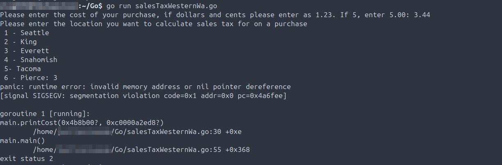
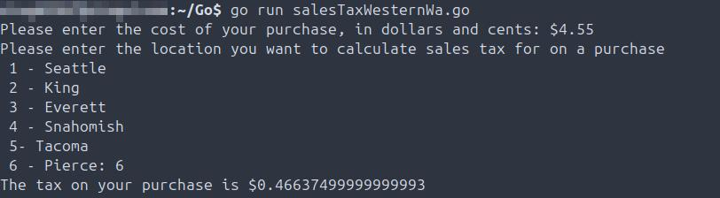
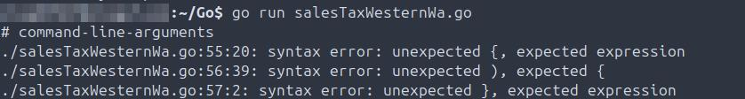
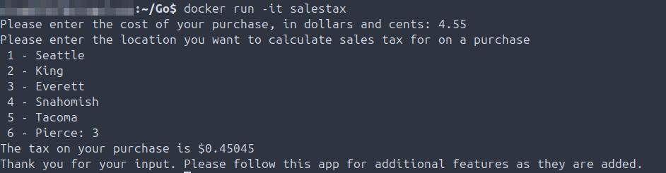

## Troubleshooting Callout
Two distinct code debugging events logged thus far.

The following logs document troubleshooting and validation events related to Go map handling and input validation.

## Code Debugging
**Summary:** Code Debugging - what went wrong and what was fixed.

- 2025-11-05 TROUBLESHOOTING: HOF variables were mismatched which was breaking the map, as they were not uniformly defined in a manner each function could call during code execution when provided with user input.

- 2025-11-05 Code validation to ensure code is prompting user for inputting then properly returning the expected integers.

- 2025-11-06 TROUBLESHOOTING: Error handling in code failing due to map of main user input function included too many data types: float64 and string. Corrected by adding HOF later in the code to an if-else statement which returns the desired string which handles erroneous input from the enduser.

- 2025-11-07 Added additional functionality - Thank you to the user after the app returns the total sales tax for their purchase, added as a defer function.

