# CI/CD Pipeline with ArgoCD and GKE

End-to-end GitOps pipeline demonstrating:
- Go application development with error handling
- Docker containerization
- GitHub Actions CI/CD
- GCP Artifact Registry integration
- ArgoCD automated deployments to GKE
- Troubleshooting and validation workflows

**Build Time:** 7 hours (including troubleshooting and validation)

## Architecture 

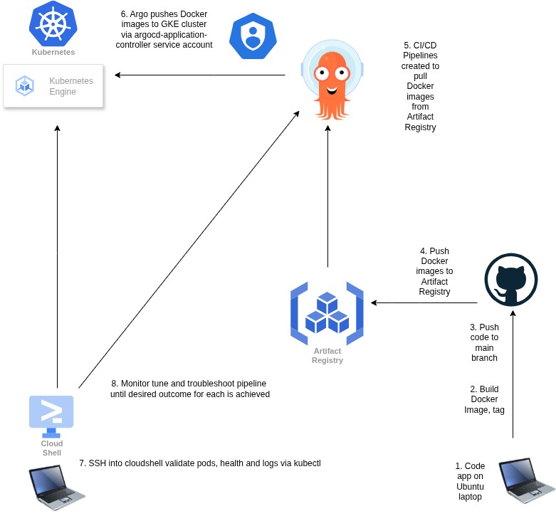

1. Code app on Ubuntu laptop
2. Build Docker image, tag
3. Push code to GitHub main branch
4. Push Docker image to GCP Artifact Registry
5. CI/CD pipeline pulls images from Artifact Registry
6. ArgoCD pushes Docker images to GKE cluster via service account
7. SSH into cloudshell, validate pods, health, and logs via kubectl
8. Monitor and troubleshoot until desired outcome

## Documented troubleshooting events:

- Go map handling and Higher-Order Function (HOF) variable mismatches
- Error handling with mixed data types (float64 and string)
- ArgoCD manifest folder structure breaking pipelines

## CI/CD Pipeline Components
- **Source Control:** GitHub
- **CI/CD Tool:** GitHub Actions
- **Container Registry:** GCP Artifact Registry
- **GitOps:** ArgoCD
- **Orchestration:** Google Kubernetes Engine (GKE)

## ArgoCD
**Summary:** Argo installation, functionality and validation.

- 2025-11-09 Install Argo on GKE cluster.
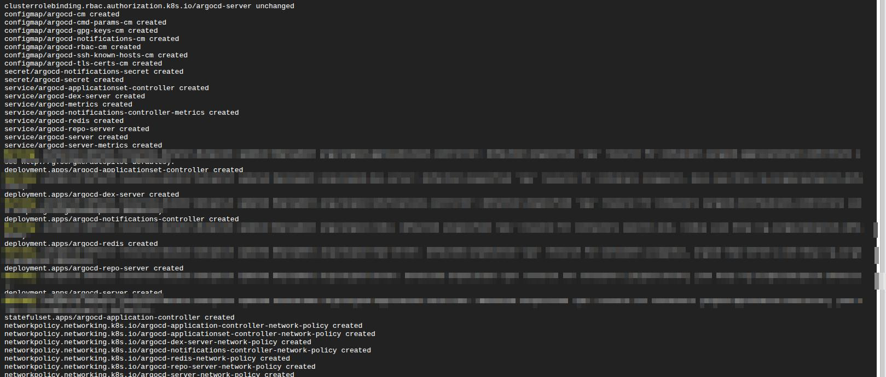

- 2025-11-09 Install Argo CLI on GKE cluster.
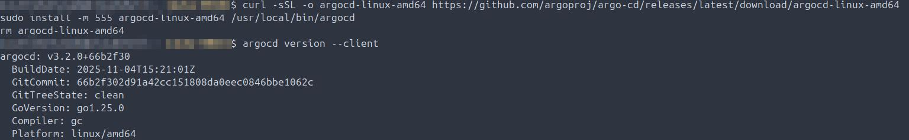

- 2025-11-09 Patch Argo to GCP provided loadbalancer, then obtain the GUI external IP.  
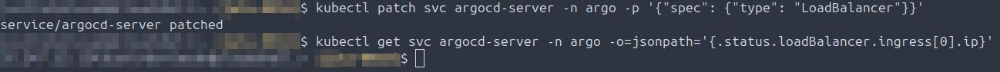

- 2025-11-09 Validate ArgoCD GUI comes up externally, login, change the admin password after obtaining the default one-time use initial password.
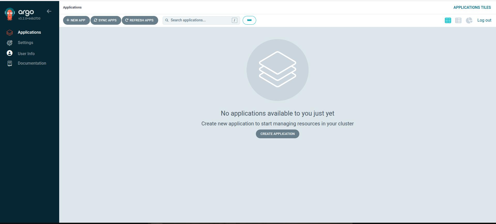

- 2025-11-09 Disable and validate that the admin account cannot login to the GUI.
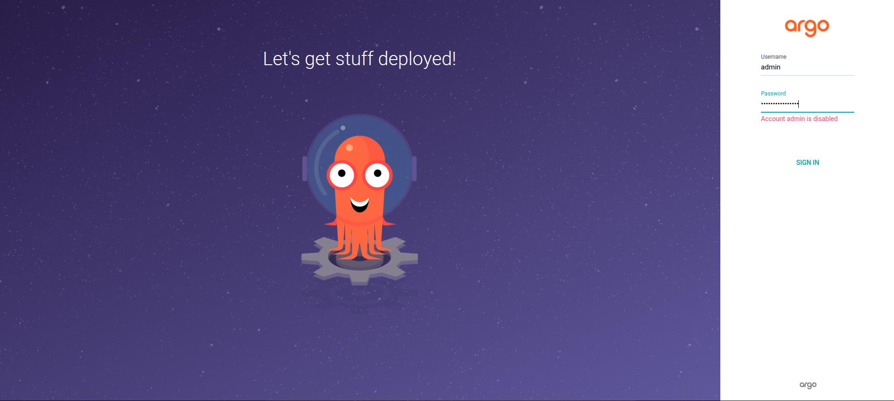

## Code Debugging
**Summary:** Code Debugging and validation - what went wrong and what was fixed.

## 2025-11-05 Issue: Higher-Order Function (HOF) variables were not uniformly defined, preventing the map from properly calling functions during user input execution.
## Fix: Standardized function signatures to match map expectations.

- 2025-11-05 Code validation to ensure code is prompting user for inputting then properly returning the expected integers.

## 2025-11-06 TROUBLESHOOTING: Error handling in code failing due to map of main user input function included too many data types: float64 and string. Corrected by adding HOF later in the code to an if-else statement which returns the desired string which handles erroneous input from the enduser.

- 2025-11-07 Added additional functionality - Thank you to the user after the app returns the total sales tax for their purchase, added as a defer function. 

- 2025-11-07 Smoke test of code once container is built using the -it flag. (Numbering out of order due to GitHub image caching bug).  
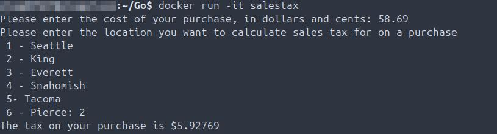

## CI/CD Pipeline Validation
**Summary:** Push to GCP Artifact registry; pipeline operation, validation, troubleshooting.

- 2025-11-09 Build both Docker images for each of the apps for Argo pipeline.
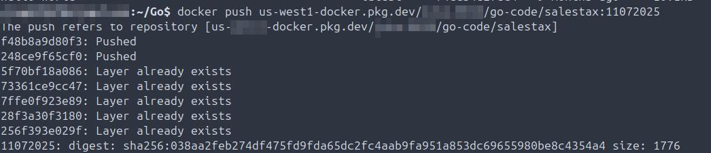

- 2025-11-09 Tag and push each of the Docker images to GCP Artifact Registry.
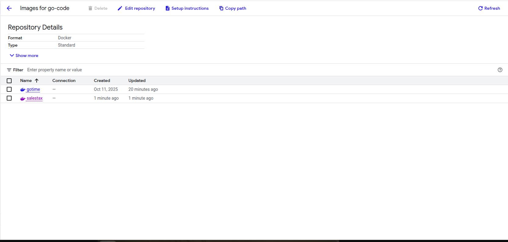

- 2025-11-09 Validate each of the Docker images is now in GCP Artifact Registry.
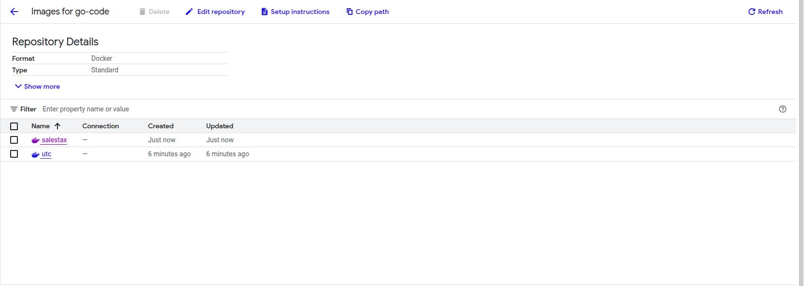

## 2025-11-09 TROUBLESHOOT: Both of the app manifests are in the same root level folder in GitHub which is breaking one of the pipelines. Deleted pipeline, created child folders in GitHub for each pipeline, then recreated individual apps in Argo.

- 2025-11-09 Validate each pipeline is synced, one the app is healthy the other it is degraded which is expected and intended behavior. 
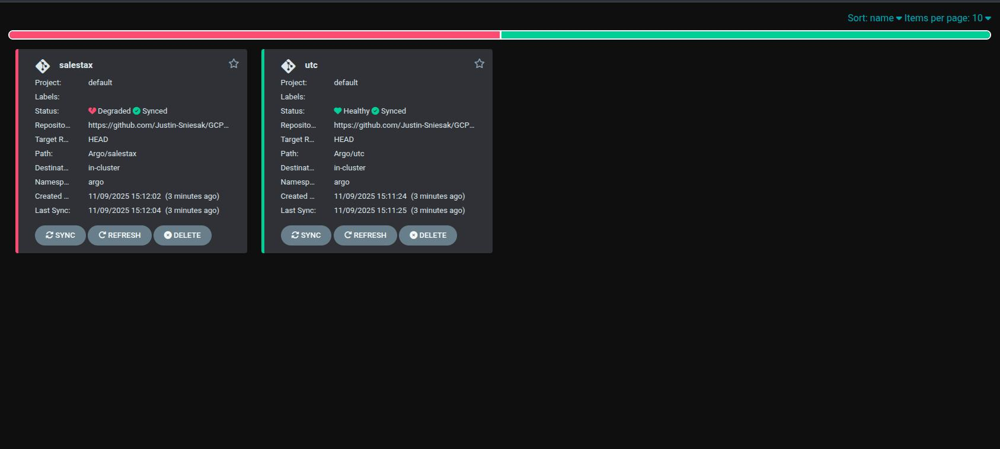

- 2025-11-09 Validate UTC Go job pod completed and returned an RC=0. Also validated expected output is returned in the pod log.
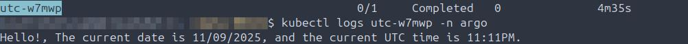

- 2025-11-09 Succesful pipeline validation of UTC Go jobpipeline.
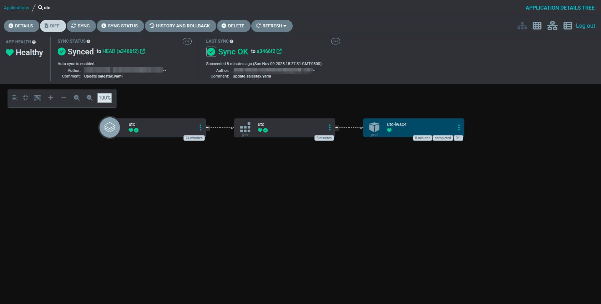

## 2025-11-09 ### Intentional Failure: Interactive Code in Non-Interactive Environment

This pipeline demonstrates the limitations of code requiring user input (`fmt.Scanf`) in Kubernetes environments:
- Code requires `exec -it` for interactive input
- Kubernetes control plane prevents pod creation for non-automated workloads
- Provided as comparison to UTC job which completed successfully (RC=0)
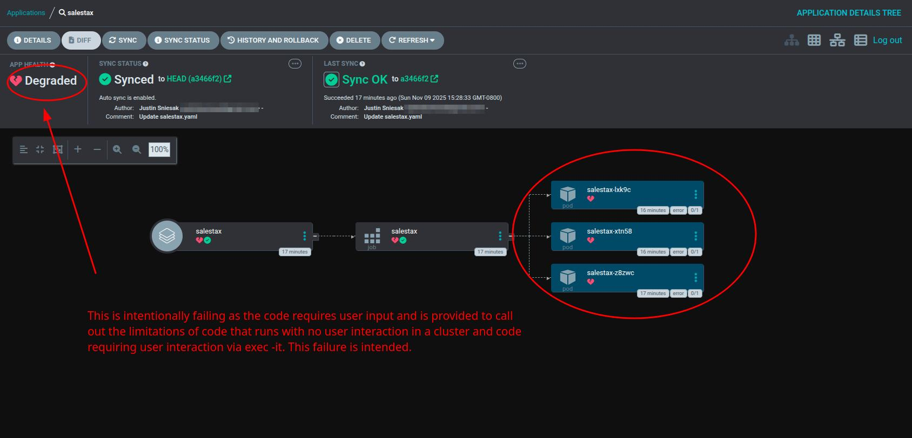

## GKE
**Summary:** Cluster creation, administration, and pipeline validation.

**2025-11-09 Create GKE autopilot cluster**
- Configuration: Autopilot mode, private IP, regular release channel
- Validated cluster is up and running
- Connected via `gcloud container clusters get-credentials`

**Cluster validated for:**
- ArgoCD deployment
- Application workload scheduling
- Service account authentication
- kubectl access for validation
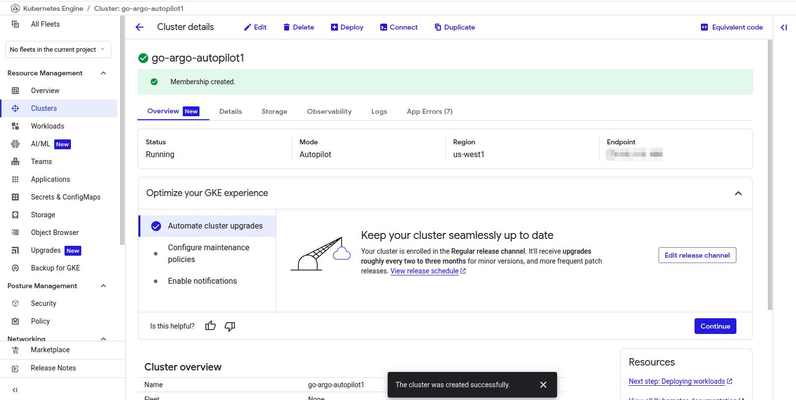

## Key Learnings

- **ArgoCD folder structure:** Multi-app repositories require separate folders per application to prevent pipeline conflicts
- **Interactive code limitations:** Applications using `fmt.Scanf` or requiring `exec -it` cannot run in non-interactive Kubernetes pods
- **HOF type consistency:** Higher-Order Functions must have uniform signatures for map-based function calls
- **Error handling:** Mixed data types (float64 and string) in maps require explicit type handling via if-else statements
- **Service account permissions:** ArgoCD application controller requires proper ClusterRoleBinding to namespace

**Build Outcome:** Complete GitOps pipeline deployed in 7 hours with full validation and intentional failure testing.

## Related Documentation

-  - Step-by-step deployment and troubleshooting guide
